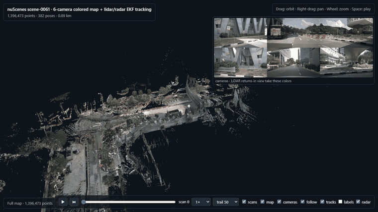

# nuScenes Camera–LiDAR–Radar Fusion with EKF Tracking

A perception pipeline for the **nuScenes** self-driving dataset. It fuses
**6 surround cameras, a 32-beam LiDAR and 5 Doppler radars** to:

- **track moving vehicles** with an Extended Kalman Filter, without using any labels;
- **build a clean, camera-colored 3D map** of each drive, with moving cars removed;
- **check LiDAR odometry** (KISS-ICP) against the dataset's own localization;
- **replay everything** in an interactive 3D viewer in the browser.



*scene-0061 replayed at 2× speed. The camera follows the vehicle through a left turn;
the 6 camera images are shown top right.*

> **SLAM or not?** The vehicle's position comes from nuScenes' own localization.
> KISS-ICP LiDAR odometry runs alongside and is **scored** against it, but the map
> and tracking use the dataset's positions. So this project is sensor fusion,
> tracking and mapping, not a full SLAM system.

---

## How it works

For each 20-second scene the pipeline runs four stages:

### 1. Odometry check (LiDAR)
- **KISS-ICP** estimates the vehicle's path from the LiDAR scans alone.
- The estimate is compared with nuScenes' localization using **ATE** (absolute
  error, after SE(3) alignment) and **RPE** (drift over 1-second windows).

### 2. Detection (LiDAR, no labels)
- **Ground removal** on a grid, then **bird's-eye-view clustering** of what is left.
- A **minimum-area box** is fitted to each cluster and kept only if it is
  shaped like a vehicle.
- An **HD-map prior** throws away detections outside the drivable area. The map
  image is decoded by streaming, so only 2–8 MB of the 1.2 GB file is read.
- Partly visible cars are completed to full size using a typical car size.

### 3. Tracking (LiDAR + radar)
- Each object gets its own **CTRV Extended Kalman Filter** (constant turn rate
  and velocity).
- New boxes are matched to tracks with **Hungarian / GNN assignment** and
  **χ² gating**.
- **Doppler radar** from all 5 radars corrects each track's velocity.
- A track is **confirmed** after 3 hits, **coasts** for 1 s when it is not seen,
  and counts as **moving** once its speed is clearly above zero (more than 2σ).

### 4. Mapping (cameras + LiDAR)
- Every LiDAR point is **colored by the 6 cameras**.
- Each camera image uses the vehicle's position **at its own capture time**, so
  the car's motion between images is compensated.
- **Occlusion** is handled by keeping only the nearest LiDAR point per pixel.
- Points on **moving tracked objects are removed**, so passing cars don't smear
  the map.

---

## Results (nuScenes v1.0-mini, all 10 scenes)

**How tracking is scored:**
- Tracks are compared with the dataset's labels in every LiDAR scan (20 Hz).
- Only vehicles within 50 m with at least 5 LiDAR points count.
- A track matches a label when their centres are within 2 m.
- *Moving* means faster than 1 m/s.
- A moving track on a parked car is not counted as a false positive.

| scene | ATE [m] | drift [%] | moving recall | moving precision | moving pos err [m] | moving vel err [m/s] | all-vehicle recall | all-vehicle precision |
|---|---|---|---|---|---|---|---|---|
| scene-0061 | 0.08 | 1.7 | 0.31 | 0.35 | 1.06 | 0.79 | 0.44 | 0.27 |
| scene-0103 | 0.28 | 3.4 | 0.35 | 0.45 | 0.85 | 1.19 | 0.45 | 0.49 |
| scene-0553 | 0.01 | – ¹ | 0.39 | 0.54 | 0.80 | 1.68 | 0.23 | 0.25 |
| scene-0655 | 0.40 | 1.7 | 0.35 | 0.27 | 0.73 | 0.61 | 0.51 | 0.53 |
| scene-0757 | 0.14 | 5.0 | 0.51 | 0.59 | 0.59 | 0.71 | 0.50 | 0.37 |
| scene-0796 | 1.58 | 2.1 | 0.46 | 0.68 | 0.64 | 1.23 | 0.55 | 0.34 |
| scene-0916 | 0.24 | 3.3 | 0.17 | 0.12 | 1.15 | 0.97 | 0.53 | 0.56 |
| scene-1077 | 0.48 | 1.0 | 0.50 | 0.62 | 0.75 | 1.32 | 0.64 | 0.46 |
| scene-1094 | 0.54 | 2.8 | 0.60 | 0.76 | 1.01 | 0.69 | 0.61 | 0.39 |
| scene-1100 | 0.07 | – ¹ | 0.47 | 0.60 | 0.73 | 1.19 | 0.60 | 0.34 |
| **median** | **0.26** | **2.5** | **0.43** | **0.57** | **0.78** | **1.08** | **0.52** | **0.38** |

¹ The vehicle is standing still, so drift per distance travelled is undefined.

**What the numbers show:**
- **Odometry:** KISS-ICP stays within a few decimetres of nuScenes' localization over 20 s drives.
- **Tracking:** moving vehicles are tracked with about **0.8 m** position error and
  **1 m/s** velocity error, using classical detection with no training data.
- **Precision:** most false alarms are static roadside objects shaped like cars.
- **Recall:** missed vehicles are mostly far away (few LiDAR points) or merged with
  nearby objects. This is the limit of geometric detection.
- **Design choices:** the HD-map prior roughly **doubled precision**, and box
  completion cut position error by about **15%**.

**Caveat:** the thresholds were tuned on these same 10 scenes. Check them on the
larger trainval split before relying on the numbers.

---

## Setup

Requires Python 3.11+.

```powershell
python -m venv .venv
.\.venv\Scripts\Activate.ps1
python -m pip install -e ".[dev]"
```

### Data

nuScenes is made of **1,000 separate 20-second scenes** recorded in Boston and
Singapore. It is not one continuous drive.

| Split | Scenes | Size | How to get it |
|---|---|---|---|
| `v1.0-mini` | 10 | 4 GB download | Already in `data/nuscenes/`, or download from <https://www.nuscenes.org/download> |
| `v1.0-trainval` | 850 | ~0.4 GB metadata + 10 blobs of ~30 GB (~85 scenes each) | `download_nuscenes.py` (below) |

Both need a free nuscenes.org account. The data is licensed CC BY-NC-SA 4.0.

**Downloading more scenes.** `download_nuscenes.py` logs in with your account and
unpacks each archive straight into `data/nuscenes/`, without keeping the `.tgz`.
Before each archive it checks there is enough free disk space.

```powershell
$env:NUSCENES_EMAIL = "you@example.com"     # or leave unset to be prompted
python download_nuscenes.py --sizes         # print exact sizes, download nothing
python download_nuscenes.py --blobs 1       # metadata + blob 1 (~30 GB)
```

When it finishes, it lists the scenes that are ready to run. If a download is
interrupted, that archive starts again from the beginning.

Expected layout:

```text
data/nuscenes/
    maps/              drivable-area masks
    samples/           keyframe sensor data (6 cameras, LIDAR_TOP, 5 radars)
    sweeps/            sensor data between keyframes
    v1.0-mini/         metadata tables (JSON)
    v1.0-trainval/     (after downloading trainval)
```

---

## Usage

```powershell
python nuscenes_pipeline.py --scene scene-0061     # one scene (about 4 minutes)
python nuscenes_pipeline.py --scene all            # all 10 mini scenes (about 40 minutes)
python nuscenes_pipeline.py --version v1.0-trainval --scene scene-0001
```

### Viewing the results

```powershell
python -m http.server 8001 -d output
```

Open <http://localhost:8001>, pick a scene from the **Scene** dropdown and press
**play** (or the space bar). Serving over HTTP is required, because the viewer
loads its data files with `fetch`.

**Viewer controls:**

| Control | What it does |
|---|---|
| **play / scrub bar / speed** | Drive through the scene, jump to any scan, play at 0.5×–10× |
| **trail** | How many recent LiDAR scans stay visible behind the vehicle |
| **scans / map** | Show the live scans and the full colored map |
| **tracks** | EKF tracks. Orange = moving, with an arrow showing 1 s of motion. Blue = static. |
| **labels** | The dataset's annotated vehicles, for comparison with the tracker |
| **radar** | Returns from all 5 radars. Red = moving (Doppler), grey = static. |
| **cameras** | The 6-camera mosaic |
| **follow** | Keep the view centred on the vehicle |

Mouse: drag to orbit, right-drag to pan, scroll to zoom. The map streams in more
detail as you zoom in.

### Outputs

Each scene writes these files to `output/`:

| File | Content |
|---|---|
| `index.html` | Scene picker for all viewers in `output/` |
| `nuscenes_<scene>_viewer/` | The 3D viewer for that scene |
| `nuscenes_<scene>_report.json` | Odometry (ATE/RPE), tracking (recall, precision, MOTA, errors) and map statistics |
| `nuscenes_<scene>_map.ply` | Camera-colored static map. Opens in CloudCompare or Open3D. |
| `nuscenes_<scene>_topdown.png` | Top-down map image with the driven route |
| `nuscenes_summary.md` | Results table (only with `--scene all`) |

**Options:**
- `--skip-viewer` makes batch runs faster.
- `--no-map-prior` turns off the drivable-area filter, for comparison.
- `python nuscenes_pipeline.py --help` lists the rest.

---

## Code

```text
nuscenes_pipeline.py      entry point: odometry check, tracking, map, viewer, report, scene picker
download_nuscenes.py      nuScenes trainval downloader
nuscenes_fusion/
    nuscenes.py           numpy-only nuScenes reader, drivable-area map (streamed PNG decode)
    odometry.py           KISS-ICP LiDAR odometry
    trajectory_eval.py    ATE / RPE metrics
    detection.py          label-free LiDAR detection: ground removal, clustering, box fitting
    tracking.py           CTRV EKF, radar model, GNN / χ² association, track management
    processing.py         tracking loop, evaluation, 6-camera coloring, static map, replay
    camera.py             pinhole projection, nearest point per pixel
    mapping.py            colored voxel map, PLY output
    visualization.py      top-down map image
    viewer_export.py      writes viewer tiles, replay and overlays
    viewer/               static Three.js viewer (three.js r126 included)
tests/                    fast unit tests (no dataset needed)
```

## Tests

```powershell
python -m pytest -q
```

The tests check:
- EKF Jacobians against finite differences;
- multi-object tracking on synthetic motion, and that static clutter is not marked as moving;
- radar Doppler updates;
- label-free detection and box completion;
- ATE / RPE;
- camera projection and occlusion;
- a viewer tile round trip.

---

## Limitations and next steps

- **Not full SLAM.** The map uses nuScenes' localization. Feeding the KISS-ICP poses into
  mapping and tracking (with loop closure) would make it a real LiDAR SLAM system.
- **Detection is geometric.** Recall is limited by far-away vehicles and vehicles merged
  with nearby objects. Vehicles taller than 3 m (buses, tall trucks) are filtered out.
  A learned 3D detector such as CenterPoint, feeding the same EKF tracker, would be the
  biggest improvement.
- **Thresholds were tuned on the same 10 mini scenes.** They still need checking on trainval.
- **Single motion model.** An IMM filter (CV + CTRV) would handle sharp manoeuvres better.

The EKF tracker comes from an earlier ADAS lead-vehicle tracker project.
